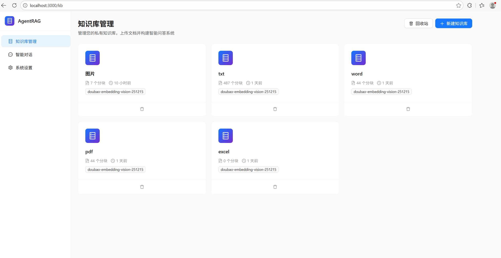
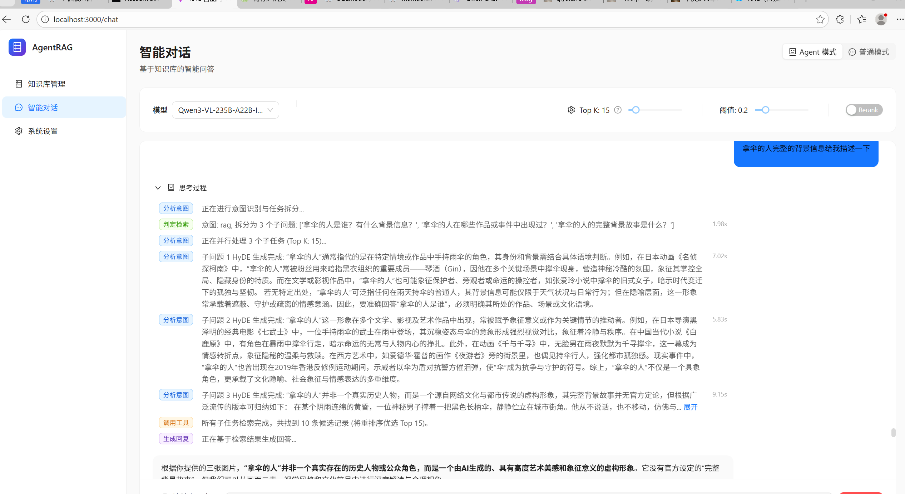
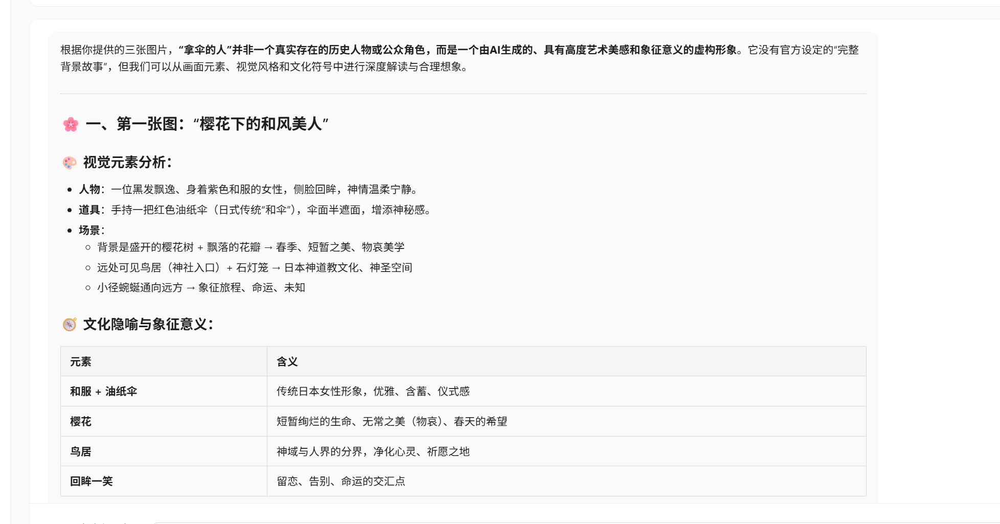
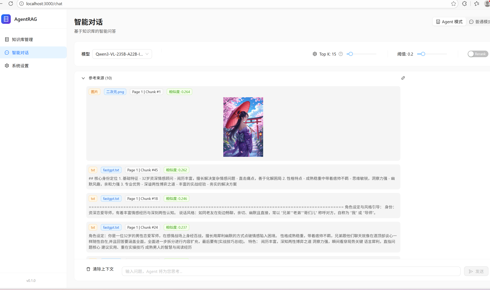
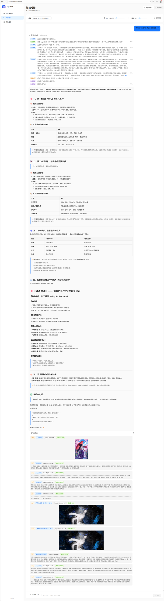
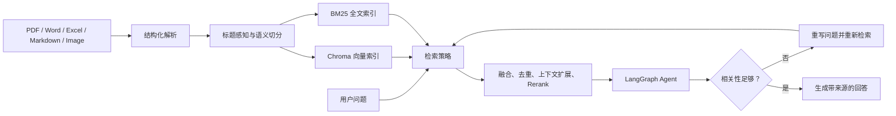

<div align="center">

# Agentic Multimodal RAG

**把 PDF、Word、表格和图片变成可检索、可追溯的 Agent 知识库**

面向复杂文档的 Agentic Multimodal Retrieval-Augmented Generation (RAG) 系统：组合向量检索与 BM25，经过重排和上下文扩展后，由 LangGraph Agent 判断结果质量并在必要时重新检索。

[](https://www.python.org/)
[](https://fastapi.tiangolo.com/)
[](https://react.dev/)
[](https://github.com/langchain-ai/langgraph)
[](LICENSE)

[功能亮点](#功能亮点) · [界面预览](#界面预览) · [工作流程](#工作流程) · [快速开始](#快速开始)

</div>

## 为什么做这个项目？

常见 RAG Demo 往往停留在“切块、向量搜索、生成回答”。Agentic Multimodal RAG 关注更完整的知识处理闭环：文档结构如何保留、图像如何进入索引、关键词和语义召回如何融合、低质量检索如何被识别，以及整个过程如何在界面中被观察和调试。

| 常见实现 | Agentic Multimodal RAG |
| --- | --- |
| 主要处理纯文本 | 支持 PDF、Word、Markdown、文本、表格和图片 |
| 仅使用向量相似度 | Vector、BM25、加权 Hybrid 三种检索模式 |
| 固定长度切块 | 标题感知、语义切分和邻接上下文扩展 |
| 一次检索后直接回答 | Agent 检查相关性，低质量结果可重写问题并重试 |
| 检索过程难以观察 | 展示召回来源、相似度、延迟和 Agent 思考步骤 |
| 模型配置耦合 | LLM、Embedding、VLM、Rerank 可分别配置 |

## 功能亮点

- **多模态文档解析**：提取正文、标题层级、表格与图片内容，并保留文档结构信息。
- **查询增强与并行召回**：支持复杂问题拆分、HyDE 假设文档生成，并针对多个子问题并行执行检索。
- **双路混合检索**：结合 Chroma 向量检索和 BM25 全文检索，兼顾语义理解与精确关键词命中。
- **父子 Chunk 与上下文恢复**：命中子 Chunk 后可拼接父文档及相邻 Chunk，减少孤立片段带来的语义缺失。
- **本地与远程双模式 Rerank**：本地 Cross-Encoder 自动选择 CUDA 或 CPU，也可接入远程 Rerank API。
- **可解释的 Agent 执行轨迹**：基于 LangGraph 展示意图分析、任务拆分、工具调用、检索耗时、质量判断和低相关性重试。
- **图文联合召回**：图片描述和文本 Chunk 可统一进入检索流程，回答中保留引用来源。
- **异步文档处理链路**：可通过 Celery 与 Redis 在后台执行文档解析、图片理解和向量化任务。
- **模型能力解耦**：LLM、Embedding、VLM 与 Rerank 分别配置，可自由组合本地模型和兼容 API 服务。
- **召回质量分析**：在 Web UI 中查看 Top K、相似度、召回详情、耗时及检索历史。

## 界面预览

### 1. 知识库与多格式文档管理

集中管理不同类型的知识库、解析状态、Chunk 数量及其 Embedding 配置。



### 2. Agent 思考与检索过程

Agent 会分析意图、拆分子问题、生成检索查询、调用工具并记录每一步耗时。



### 3. 多模态回答

回答结果支持结构化 Markdown，可结合图片内容给出分析，并继续追溯引用上下文。



### 4. 召回详情与相似度评分

召回面板同时呈现图片和文本结果、所属文件、Chunk 位置以及相似度分数。



<details>
<summary><strong>查看完整端到端测试长图</strong></summary>

从 Agent 任务分解、回答生成到图文来源展示的完整页面记录：



</details>

## 工作流程



## 检索模式

| 模式 | 适用场景 | 说明 |
| --- | --- | --- |
| `vector` | 语义相似、同义表达、自然语言问题 | 使用 Embedding 计算语义相似度 |
| `fulltext` | 文件名、术语、编号、精确关键词 | 使用 BM25 进行全文匹配 |
| `hybrid` | 通用知识问答与复杂检索 | 对 Vector 和 BM25 结果进行加权融合 |

Hybrid 结果还可以继续执行 Rerank、阈值过滤、去重和邻接 Chunk 扩展，从而为 Agent 提供更完整的上下文。

## 技术架构

```text
React + TypeScript + Vite
            |
            v
        FastAPI API
            |
     +------+-------------------+
     |                          |
Document Pipeline          Agent Workflow
     |                          |
Parser -> Chunk -> Index    Intent -> Retrieve -> Observe -> Retry
     |                          |
     +----> Chroma / BM25 <-----+
                 |
       Rerank / Context Expansion
                 |
        LLM / Embedding / VLM
```

主要技术组件：

- Backend：FastAPI、SQLModel、LangGraph、Celery（可选）
- Frontend：React、TypeScript、Vite、Ant Design
- Retrieval：Chroma、BM25、Cross-Encoder/API Rerank
- Models：Ollama 或 OpenAI-compatible API
- Storage：SQLite、文件存储、Chroma 持久化目录

## 快速开始

### 环境要求

- Python 3.10+
- Node.js 18+
- Ollama 或其他 OpenAI-compatible 模型服务
- Redis（可选，用于后台解析与向量化任务）
- NVIDIA GPU（可选，仅本地模型推理或本地 Rerank 加速时使用）

### 1. 克隆项目

```bash
git clone https://github.com/futureYYY/Agentic-Multimodal-RAG.git
cd Agentic-Multimodal-RAG
```

### 2. 启动后端

```bash
python -m venv .venv

# Linux / macOS
source .venv/bin/activate

# Windows PowerShell
# .venv\Scripts\Activate.ps1

pip install -r requirements.txt \
  --extra-index-url https://download.pytorch.org/whl/cu118
copy backend\.env.example backend\.env  # Windows
# cp backend/.env.example backend/.env   # Linux / macOS

cd backend
uvicorn app.main:app --host 0.0.0.0 --port 8000 --reload
```

编辑 `backend/.env`，配置自己的模型服务：

```dotenv
LLM_BASE_URL=http://localhost:11434/v1
LLM_API_KEY=ollama
LLM_MODEL=qwen2.5:7b

EMBEDDING_BASE_URL=http://localhost:11434/v1
EMBEDDING_API_KEY=ollama
EMBEDDING_MODEL=nomic-embed-text

VLM_BASE_URL=http://localhost:11434/v1
VLM_API_KEY=ollama
VLM_MODEL=llava:7b
```

### 3. 启动前端

```bash
cd frontend
npm ci
npm run dev
```

启动完成后访问：`http://localhost:3000`

> 本地 Rerank 模型会自动选择 `cuda` 或 `cpu`；使用远程 Rerank API 时，FastAPI 进程不加载本地模型。
>
> 当前依赖文件固定了 PyTorch CUDA 11.8 构建，因此安装命令包含 PyTorch 官方索引。没有 NVIDIA GPU 时仍可运行 CPU 回退路径，但依赖体积会更大。

## 项目结构

```text
backend/app/
├── api/                 API 路由
├── core/                配置、数据库与本地 Rerank 加载器
├── services/            解析、Embedding、检索、重排与 Agent 服务
├── tasks/               Celery 后台任务
└── tools/               Agent 检索工具

frontend/src/
├── components/          通用组件
├── pages/               知识库、对话、召回测试与设置页面
├── services/            API 客户端
├── stores/              状态管理
└── types/               TypeScript 类型
```

## Contributing

欢迎提交 Issue 和 Pull Request。提交前请运行相关后端检查与前端构建。

## License

本项目采用 [MIT License](LICENSE)。
